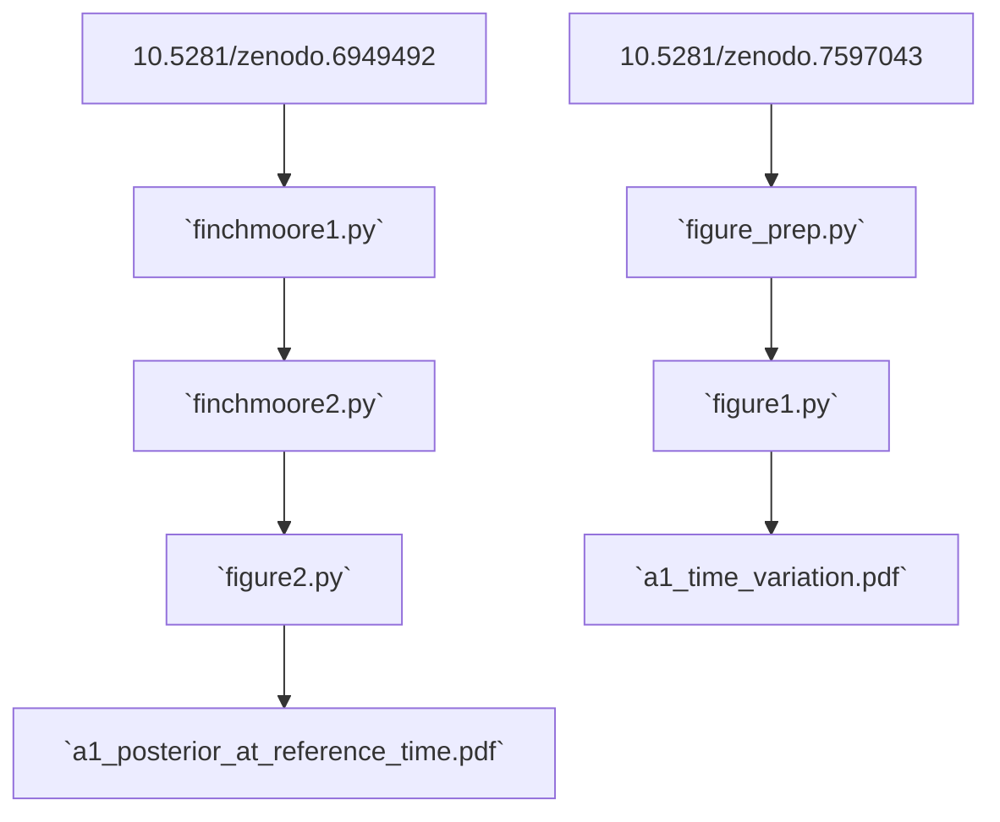

# Software

## Plotting scripts

The files in this directory are the Python scripts used to produce the figures
in the draft from the data in https://doi.org/10.5281/zenodo.7597043 and
https://doi.org/10.5281/zenodo.6949492. These scripts are automatically run by
_[showyourwork](http://show-your.work)_ to produce the manuscript. They are
related as follows:

Some intermediate data products are generated in the process and cached by
_showyourwork_ to speed up computation.

## Ringdown fits

The results plotted by the scripts here were originally produced by the
_[ringdown](https://github.com/maxisi/ringdown)_ or
_[pyRing](https://git.ligo.org/lscsoft/pyring)_ software packages. Further
information to reproduce those results from LIGO strain data is provided in the
Zenodo (https://doi.org/10.5281/zenodo.7597043), where the results of the fits
are hosted.
