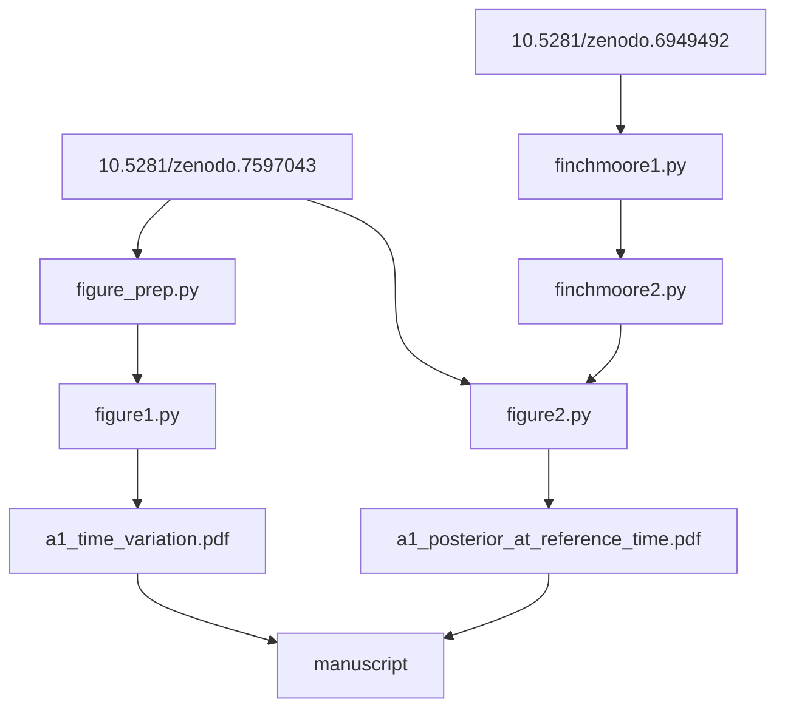

# Software

## Plotting scripts

The files in this directory are the Python scripts used to produce the figures
in the draft from the data in Zenodo: Isi & Farr [10.5281/zenodo.7597043](https://doi.org/10.5281/zenodo.7597043), and
Finch & Moore [10.5281/zenodo.6949492](https://doi.org/10.5281/zenodo.6949492). These scripts are automatically run by
_[showyourwork](http://show-your.work)_ to produce the manuscript. They are
related as follows:



The environment requirements to execute these scripts are specified in the [`environment.yml`](https://github.com/maxisi/gw150914_rd_comment/blob/main/environment.yml) in the source directory; if not using `showyourwork`, this can be used to create a compatible Conda environment by doing, e.g.,

```
conda env create -f environment.yml
```

Some intermediate data products are generated in the process and cached by
_showyourwork_ to speed up computation and skip some intermediate steps.

## Ringdown fits

The results plotted by the scripts here were originally produced by the
_[ringdown](https://github.com/maxisi/ringdown)_ or
_[pyRing](https://git.ligo.org/lscsoft/pyring)_ software packages. Further
information to reproduce those results from LIGO strain data is provided in the
Zenodo data release (https://doi.org/10.5281/zenodo.7597043), where the results 
of the fits are hosted.

See also the [_ringddown_ documentation](https://ringdown.readthedocs.io/en/latest/index.html) and the [_pyRing_ documentation](https://lscsoft.docs.ligo.org/pyring/).
